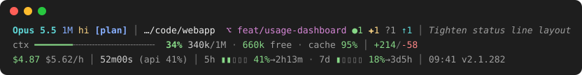

# Status line reference

`claude/statusline-command.sh` turns the JSON that Claude Code sends whenever the session changes, such as when a new message arrives, into three lines of coloured text. This page explains every segment, the colours, and how the layout adapts to the terminal width.

## Line 1: model and workspace

| Segment | Example | Meaning |
|---|---|---|
| Model | `Opus 5.5` | The model's display name |
| Context badge | `1M` | Shown for models with a one-million-token context window |
| Effort | `lo` `med` `hi` `xhi` `max` | The reasoning effort level |
| Thinking | `∴` | Extended thinking is on |
| Fast mode | `⚡` | Fast mode is on |
| Permission mode | `[plan]` `[accept]` `[auto]` `[bypass]` | Any mode other than the default |
| Vim mode | `N` `I` | Normal or insert mode, when vim keys are enabled |
| Output style | `⚑Explanatory` | Any output style other than the default |
| Directory | `…/code/webapp` | The last two parts of the working directory, with the home folder shortened to `~` |
| Not at project root | `*` | The working directory is not the project root, for example a subdirectory of it |
| Extra directories | `+2d` | Directories added to the session with `/add-dir` |
| Git branch | `⌥ feat/usage-dashboard` | Cut to 24 characters. `↯` means the branch has no upstream |
| Git state | `●1 ✚1 ?1 !1 ⚑1 ↑1 ↓1` | Staged, modified, untracked and conflicted files; stashes; commits ahead of and behind the upstream |
| Session name | *Tighten status line layout* | Up to the terminal width minus 62 characters, at most 44. Hidden below 70 columns |

Claude Code does not send the permission mode, so the script reads it from the end of the session transcript. It remembers the last value it found in `~/.claude/cache/statusline/<session>.mode`, so the mode stays visible in long sessions where the transcript no longer mentions it near the end.

The branch and session name limits count characters when bash runs the script, as the recommended setting does. Under dash they count bytes, so names with accented or non-Latin letters are cut shorter and can end mid-character.

## Line 2: context window

| Segment | Example | Meaning |
|---|---|---|
| Context bar | `ctx ━━━━━━━╌╌╌╌╌╌╌╌╌╌╌╌╌╌╌  34%` | How full the context window is |
| Usage | `340k/1M` | Tokens used and window size |
| Free | `660k free` | Tokens left before the window is full |
| Cache hits | `cache 95%` | Share of the latest request's input read from the prompt cache. Green from 80%, yellow from 50%, red below |
| Cache breakdown | `(rd 318k wr 11.2k new 2.4k)` | Input tokens read from the cache, written to it, and sent uncached |
| Lines changed | `+214/-58` | Lines added and removed in the session |
| Over 200k | `≫200k` | The latest response counted more than 200k tokens in total, whatever the window size |
| Warning | `⚠ ctx filling` / `⚠ compacting soon` | The context is 80% or 90% full. Claude Code compacts the conversation when it fills up |

## Line 3: spend and limits

| Segment | Example | Meaning |
|---|---|---|
| Cost | `$4.87` | Session cost in US dollars |
| Burn rate | `$5.62/h` | Cost per hour, shown after the first 30 seconds |
| Duration | `52m00s` | Wall-clock time since the session started |
| API time | `(api 21m50s 41%)` | Time spent waiting on the model, and its share of the session |
| Rate limits | `5h ▮▮▯▯▯ 41%→2h13m` | Use of the five-hour and seven-day plan limits, and the time until each resets |
| Clock and version | `23:02 v2.1.282` | Local time and the Claude Code version |

## Colours

The context bar and both rate limits share one scale, so a colour means the same thing on all three:

| Colour | Range |
|---|---|
| Green | below 50% |
| Cyan | 50% to 69% |
| Yellow | 70% to 84% |
| Red | 85% and above |

Text uses three shades of grey. The lightest is for values, the middle one for labels, and the darkest only for separators. The palette is tuned for contrast on a dark background around `#1e1e1e`.

## Width

Claude Code passes the terminal width in `COLUMNS`. The script picks one of four levels of detail from it:

| Width | What is shown |
|---|---|
| 150 columns or more | Everything, including the cache breakdown and the API time |
| 110 to 149 | Drops the cache breakdown; API time shows only its share |
| 88 to 109 | Also drops API time and the version, and shortens the context warnings to `⚠` |
| Below 88 | Only the essentials: free tokens move into brackets, and cache hits, burn rate, reset times and the clock disappear |

The context bar shrinks from 22 cells to 10 as the terminal narrows.

## Cost of running it

Claude Code can run the script many times a minute, so it is kept cheap. It parses the input with a single `jq` call, reads git state with one `git rev-parse` and one `git status`, reads at most the last 256 KB of the transcript, and never touches the network. It is written for POSIX `sh`, and CI runs it under both dash and bash.

If `jq` is missing, or the input cannot be parsed, the script prints a one-line explanation instead of failing, so the status line never goes blank without a reason.
